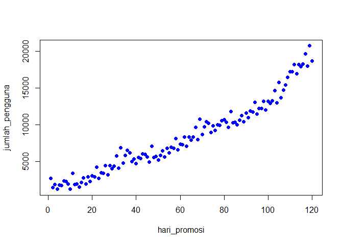

Project OK Clean
================
Asniar
5/24/2019

## Master

## Aktifkan Library

``` r
library(readr)
library(rpart)
library(rattle)
```

    ## Rattle: A free graphical interface for data science with R.
    ## Version 5.2.0 Copyright (c) 2006-2018 Togaware Pty Ltd.
    ## Type 'rattle()' to shake, rattle, and roll your data.

``` r
library(rpart.plot) #Library untuk plot dan nampilin grafik
library(RColorBrewer)
```

## Import data

``` r
pengguna <- read_csv("../data-raw/001_ok-clean_pengguna.csv")
```

    ## Parsed with column specification:
    ## cols(
    ##   hari_promosi = col_double(),
    ##   jumlah_pengguna = col_double()
    ## )

``` r
pengguna
```

    ## # A tibble: 120 x 2
    ##    hari_promosi jumlah_pengguna
    ##           <dbl>           <dbl>
    ##  1            1            2660
    ##  2            2            1459
    ##  3            3            1831
    ##  4            4            1193
    ##  5            5            1803
    ##  6            6            1685
    ##  7            7            2318
    ##  8            8            2245
    ##  9            9            1928
    ## 10           10            1229
    ## # ... with 110 more rows

``` r
komplain <- read_csv("../data-raw/001_ok-clean_komplain.csv")
```

    ## Parsed with column specification:
    ## cols(
    ##   hari_promosi = col_double(),
    ##   jumlah_komplain = col_double()
    ## )

``` r
komplain
```

    ## # A tibble: 120 x 2
    ##    hari_promosi jumlah_komplain
    ##           <dbl>           <dbl>
    ##  1            1             256
    ##  2            2             136
    ##  3            3             174
    ##  4            4             110
    ##  5            5             171
    ##  6            6             161
    ##  7            7             224
    ##  8            8             218
    ##  9            9             186
    ## 10           10             116
    ## # ... with 110 more rows

``` r
keuntungan <- read_csv("../data-raw/001_ok-clean_keuntungan.csv")
```

    ## Parsed with column specification:
    ## cols(
    ##   hari_promosi = col_double(),
    ##   jumlah_keuntungan = col_double()
    ## )

``` r
keuntungan
```

    ## # A tibble: 120 x 2
    ##    hari_promosi jumlah_keuntungan
    ##           <dbl>             <dbl>
    ##  1            1          21275219
    ##  2            2          11630734
    ##  3            3          14589289
    ##  4            4           9410724
    ##  5            5          14288265
    ##  6            6          13222574
    ##  7            7          18274420
    ##  8            8          17681269
    ##  9            9          15121308
    ## 10           10           9456333
    ## # ... with 110 more rows

### Creating Linear Regression Model

Dalam praktek kali ini kita akan membuat model regresi linear untuk
memprediksi jumlah pengguna, jumlah komplain dan jumlah keuntungan
berdasarkan waktu hari promosi.

``` r
# Membuat model 
# lm([target attribute] ~ [predictor attributes], data = [data source])
set.seed(1234)
linearmodel_pengguna = lm(jumlah_pengguna ~ hari_promosi,
               data = pengguna)
linearmodel_komplain = lm(jumlah_komplain ~ hari_promosi,
               data = komplain)
linearmodel_keuntungan = lm(jumlah_keuntungan ~ hari_promosi,
               data = keuntungan)

#Melihat model yang dibuat. 
linearmodel_pengguna
```

    ## 
    ## Call:
    ## lm(formula = jumlah_pengguna ~ hari_promosi, data = pengguna)
    ## 
    ## Coefficients:
    ##  (Intercept)  hari_promosi  
    ##        28.91        137.13

``` r
linearmodel_komplain
```

    ## 
    ## Call:
    ## lm(formula = jumlah_komplain ~ hari_promosi, data = komplain)
    ## 
    ## Coefficients:
    ##  (Intercept)  hari_promosi  
    ##      -686.79         32.49

``` r
linearmodel_keuntungan
```

    ## 
    ## Call:
    ## lm(formula = jumlah_keuntungan ~ hari_promosi, data = keuntungan)
    ## 
    ## Coefficients:
    ##  (Intercept)  hari_promosi  
    ##     13615039        692798

``` r
#melihat summary model yang dibuat. 
summary(linearmodel_pengguna)
```

    ## 
    ## Call:
    ## lm(formula = jumlah_pengguna ~ hari_promosi, data = pengguna)
    ## 
    ## Residuals:
    ##     Min      1Q  Median      3Q     Max 
    ## -1826.9  -941.7  -199.0   627.9  4372.8 
    ## 
    ## Coefficients:
    ##              Estimate Std. Error t value Pr(>|t|)    
    ## (Intercept)    28.913    228.453   0.127      0.9    
    ## hari_promosi  137.128      3.277  41.846   <2e-16 ***
    ## ---
    ## Signif. codes:  0 '***' 0.001 '**' 0.01 '*' 0.05 '.' 0.1 ' ' 1
    ## 
    ## Residual standard error: 1243 on 118 degrees of freedom
    ## Multiple R-squared:  0.9369, Adjusted R-squared:  0.9363 
    ## F-statistic:  1751 on 1 and 118 DF,  p-value: < 2.2e-16

``` r
summary(linearmodel_komplain)
```

    ## 
    ## Call:
    ## lm(formula = jumlah_komplain ~ hari_promosi, data = komplain)
    ## 
    ## Residuals:
    ##     Min      1Q  Median      3Q     Max 
    ## -1092.0  -640.5  -117.6   412.1  2444.0 
    ## 
    ## Coefficients:
    ##              Estimate Std. Error t value Pr(>|t|)    
    ## (Intercept)  -686.791    150.049  -4.577 1.17e-05 ***
    ## hari_promosi   32.486      2.152  15.093  < 2e-16 ***
    ## ---
    ## Signif. codes:  0 '***' 0.001 '**' 0.01 '*' 0.05 '.' 0.1 ' ' 1
    ## 
    ## Residual standard error: 816.7 on 118 degrees of freedom
    ## Multiple R-squared:  0.6588, Adjusted R-squared:  0.6559 
    ## F-statistic: 227.8 on 1 and 118 DF,  p-value: < 2.2e-16

``` r
summary(linearmodel_keuntungan)
```

    ## 
    ## Call:
    ## lm(formula = jumlah_keuntungan ~ hari_promosi, data = keuntungan)
    ## 
    ## Residuals:
    ##       Min        1Q    Median        3Q       Max 
    ## -23625062  -5266496   -321237   6943163  21061863 
    ## 
    ## Coefficients:
    ##              Estimate Std. Error t value Pr(>|t|)    
    ## (Intercept)  13615039    1768467   7.699 4.65e-12 ***
    ## hari_promosi   692798      25367  27.311  < 2e-16 ***
    ## ---
    ## Signif. codes:  0 '***' 0.001 '**' 0.01 '*' 0.05 '.' 0.1 ' ' 1
    ## 
    ## Residual standard error: 9626000 on 118 degrees of freedom
    ## Multiple R-squared:  0.8634, Adjusted R-squared:  0.8622 
    ## F-statistic: 745.9 on 1 and 118 DF,  p-value: < 2.2e-16

Dari hasil diatas, kita dapat melihat bahwa persaman regresi linear dari
model tersebut adalah : Jumlah Pengguna = 28.91 + (137.13xhari\_promosi)

``` r
# jumlah_pengguna = Intercept + (Slope*hari_promosi)
# jumlah_komplain = Intercept + (Slope*hari_promosi)
# jumlah_keuntungan = Intercept + (Slope*hari_promosi)
```

#### Residual

Salah satu cara untuk menguji kualitas kesesuaian model regressi adalah
dengan melihat nilai residual atau perbedaan antara nilai riil dan nilai
prediksi. Model yang bagus memiliki nilai residu yang kecil (mendekati
nol).

``` r
#Melihat nilai residual
summary(linearmodel_pengguna$residuals)
```

    ##    Min. 1st Qu.  Median    Mean 3rd Qu.    Max. 
    ## -1826.9  -941.7  -199.0     0.0   627.9  4372.8

``` r
summary(linearmodel_komplain$residuals)
```

    ##    Min. 1st Qu.  Median    Mean 3rd Qu.    Max. 
    ## -1092.0  -640.5  -117.6     0.0   412.1  2444.0

``` r
summary(linearmodel_keuntungan$residuals)
```

    ##      Min.   1st Qu.    Median      Mean   3rd Qu.      Max. 
    ## -23625062  -5266496   -321237         0   6943163  21061863

### Diagnostic plot Visualization

Di R, kita dapat memahami model melaui diagnostic plot:

``` r
par(mfrow=c(2,2))
plot(linearmodel_pengguna)
```

<!-- -->

``` r
plot(linearmodel_komplain)
```

<!-- -->

``` r
plot(linearmodel_keuntungan)
```

<!-- -->

## Model Visualization

``` r
#Memvisualisasikan Model Linear Regression
plot(pengguna, pch = 16, col = "blue") 
```

<!-- -->

``` r
#abline(linearmodel_pengguna)
plot(komplain, pch = 16, col = "red") 
```

<!-- -->

``` r
#abline(linearmodel_komplain)
plot(keuntungan, pch = 16, col = "green") 
```

<!-- -->

``` r
#abline(linearmodel_keu)
```

## Prediksi Manajer Pemasaran di hari ke-130, 150, dan 200

``` r
#prediksi_pengguna<- predict(linearmodel_pengguna,newdata = data.frame(hari_promosi = 130)) -->kalau 1 data, ga pake c

prediksi_pengguna <- predict(linearmodel_pengguna,newdata = data.frame(hari_promosi = c(130, 150, 200)))
prediksi_pengguna
```

    ##        1        2        3 
    ## 17855.57 20598.14 27454.54

``` r
#pengguna_hari130 <- predict(linearmodel_pengguna,newdata = data.frame(hari_promosi = 130))
#pengguna_hari150 <- predict(linearmodel_pengguna,newdata = data.frame(hari_promosi = 150))
#pengguna_hari200 <- predict(linearmodel_pengguna,newdata = data.frame(hari_promosi = 200))

#pengguna_hari130
#pengguna_hari150
#pengguna_hari200
```

## Prediksi Manajer Layanan Konsumen di hari ke-130, 150, dan 200

``` r
prediksi_komplain <- predict(linearmodel_komplain,newdata = data.frame(hari_promosi = c(130, 150, 200)))
prediksi_komplain
```

    ##        1        2        3 
    ## 3536.381 4186.099 5810.396

``` r
#
```

## Prediksi Manajer Keuangan di hari ke-130, 150, dan 200

``` r
prediksi_keuntungan <- predict(linearmodel_keuntungan,newdata = data.frame(hari_promosi = c(130, 150, 200)))
prediksi_keuntungan
```

    ##         1         2         3 
    ## 103678825 117534793 152174710

``` r
#
```

## Prediksi Ketiga Manajer

1.  Adakah pola mencurigakan yang terjadi dalam data pada masing –
    masing arsip? Ada

2.  Kapan pola tersebut tersebut mulai terjadi? Mulai hari ke-100

3.  Mengapa hal tersebut dapat terjadi? Karena ada ledakan komplain di
    mulai hari ke-100 yang membuat keuntungan menurun meskipun jumlah
    pelanggan naik. Promosi kinerjanya turun,

4.  Akankah temuan tersebut jika berlangsung secara terus – menerus
    dapat merugikan perusahaan? Iya

5.  Keputusan apa yang sebaiknya diambil oleh perusahaan?
